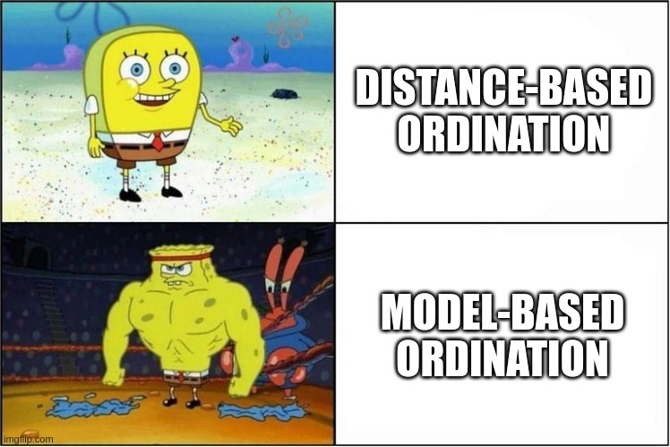

```{r setup, include=FALSE}
library(knitr)

default_source_hook <- knit_hooks$get('source')
default_output_hook <- knit_hooks$get('output')

knit_hooks$set(
  source = function(x, options) {
    paste0(
      "\n::: {.codebox data-latex=\"\"}\n\n",
      default_source_hook(x, options),
      "\n\n:::\n\n")
  }
)

knit_hooks$set(
  output = function(x, options) {
    paste0(
      "\n::: {.codebox data-latex=\"\"}\n\n",
      default_output_hook(x, options),
      "\n\n:::\n\n")
  }
)

knitr::opts_chunk$set(echo = TRUE)
```

# Introduction

## Welcome! \emoji{smile}

\center
{width=60%}

## Who-is-who

\centering

\begin{columns}
\column{0.5\textwidth}
\begin{figure}
\includegraphics[height=25mm]{bert.jpg}
\caption{Bert}
\end{figure}

\column{0.5\textwidth}
\begin{figure}
\includegraphics[height=25mm]{audun.jpg}
\caption{Audun}
\end{figure}
\end{columns}

Who are you, what do you study, and what do you hope to learn?

## Schedule

\footnotesize

|Time         |Subject                                                 |
|-------------|:-------------------------------------------------------|
|8:30 - 9:00  |[Introduction](https://github.com/BertvanderVeen/Nof2025GLLVMworkshop/blob/main/Introduction/Introduction.pdf)                                    |
|9:00 - 10:00 |[Multispecies (Vector) GLM(Ms)](https://github.com/BertvanderVeen/Nof2025GLLVMworkshop/blob/main/VGLMMs/VectorGLMMs.pdf)                           |
|10:00 - 10:15|Break                                                   |
|10:15 - 11:00|Exercise 1
|11:00 - 11:45|[Joint Species Distribution Models](https://github.com/BertvanderVeen/Nof2025GLLVMworkshop/blob/main/JSDM/JSDM.pdf)                       |
|11:45 - 12:45|Lunch                                                   |
|12:45 - 13:30|Exercise 2
|13:30 - 14:15|[Model-based ordination](https://github.com/BertvanderVeen/Nof2025GLLVMworkshop/blob/main/Ordination/Ordination.pdf)                                |
|14:15 - 14:30|Break                                                   |
|14:30 - 15:15|Exercise 3
|15:15 - 16:00|Multivariate analysis A-Z                               |
|16:00 - 17:00|Buffer time/Questions/Discussion/Own analysis           |
|-------------|--------------------------------------------------------|


## Workshop material

[See github for all material: https://github.com/BertvanderVeen/Nof2025GLLVMworkshop](https://github.com/BertvanderVeen/Nof2025GLLVMworkshop)

## How we will do it

Lectures of about 45 minutes \newline
Practicals of about 45 minutes: datasets and R

\begin{columns}

\column{0.5\textwidth}

Practical sandwich:
\begin{itemize}
\item Small practical task
\item Discuss together
\item Another practical task
\end{itemize}
\column{0.5\textwidth}
\includegraphics{sandwich.jpg}
\end{columns}

## What I hope you take away

1. The \texttt{gllvm} \texttt{R}-package is great!
2. Performing multivariate analysis well is hard work
3. Contemporary methods are much more flexible than classical methods
4. One framework for all multivariate analysis

\center
{width=50%}

## Some resources: classical analysis

- [David Zeneley's website](https://www.davidzeleny.net/anadat-r/doku.php/en:ordination)
- [Michael Palmer's website](https://ordination.okstate.edu/overview.htm)
- [Numerical ecology](https://shop.elsevier.com/books/numerical-ecology/legendre/978-0-444-53868-0)
- [Numerical ecology with R](https://link.springer.com/book/10.1007/978-1-4419-7976-6)
- [Data analysis in Community and Landscape ecology](https://www.cambridge.org/core/books/data-analysis-in-community-and-landscape-ecology/CF8B1E39A3A586FF7A3C76B514EA96A5)
- [Analysis of ecological communities](https://www.wildblueberrymedia.net/store/analysis-of-ecological-communities)

## Some resources: model-based analysis

- [Some of my other workshop repositories](https://github.com/BertvanderVeen)
- [gllvm vignette website](https://jenniniku.github.io/gllvm/)
- [Oxford libraries article](https://www.oxfordbibliographies.com/display/document/obo-9780199830060/obo-9780199830060-0003.xml)
- [Warton 2022](https://link.springer.com/book/10.1007/978-3-030-88443-7)
- [Fahrmeir and Tutz 2001](https://www.amazon.com/Multivariate-Statistical-Modelling-Generalized-Statistics/dp/0387951873)
- [Ovaskainen and Abrego](https://www.cambridge.org/core/books/joint-species-distribution-modelling/0D9FA93EA1DD408332A17266449668B3)
- [Bartholomew et al. 2011](https://onlinelibrary.wiley.com/doi/book/10.1002/9781119970583)
- [Skrondal and Rabe-Hesketh 2004](https://www.taylorfrancis.com/books/mono/10.1201/9780203489437/generalized-latent-variable-modeling-anders-skrondal-sophia-rabe-hesketh)
- [Zuur and Ieno 2025](https://www.highstat.com/index.php/our-books?view=article&id=48&catid=18)

## Some recommended reading

\columnsbegin
\column{0.5\textwidth}

- [Halvorsen (2012)](http://nhm2.uio.no/botanisk/nbf/temp/Sommerfeltia_35_20121206_PRESS.pdf)
- [Wang et al. (2012)](https://besjournals.onlinelibrary.wiley.com/doi/10.1111/j.2041-210X.2012.00190.x)
- [Warton et al. (2012)](https://besjournals.onlinelibrary.wiley.com/doi/abs/10.1111/j.2041-210X.2011.00127.x)
- [Clark et al. (2014)](https://esajournals.onlinelibrary.wiley.com/doi/abs/10.1890/13-1015.1)
- [Warton et al. (2015)](https://doi.org/10.1016/j.tree.2015.09.007)
- [Warton et al. (2015)](https://link.springer.com/article/10.1007/s11258-014-0366-3)
- [Hui et al. (2015)](https://besjournals.onlinelibrary.wiley.com/doi/10.1111/2041-210X.12236)
- [Pollock et al. (2015)](https://besjournals.onlinelibrary.wiley.com/doi/10.1111/2041-210X.12180)
- [ter  Braak and Smilauer (2015)](https://link.springer.com/article/10.1007/s11258-014-0356-5)
- [Hui et al. (2017)](https://www.tandfonline.com/doi/abs/10.1080/10618600.2016.1164708)
- [Niku et al. (2017)](https://link.springer.com/article/10.1007/s13253-017-0304-7)
- [Ovaskainen et al. (2017)](https://onlinelibrary.wiley.com/doi/full/10.1111/ele.12757)

\column{0.5\textwidth}

- [Roberts (2017)](https://besjournals.onlinelibrary.wiley.com/doi/full/10.1111/2041-210X.12739)
- [Warton et al. (2017)](https://besjournals.onlinelibrary.wiley.com/doi/abs/10.1111/2041-210X.12843)
- [Niku et al. (2019)](https://besjournals.onlinelibrary.wiley.com/doi/abs/10.1111/2041-210X.13303)
- [Niku et al. (2019)](https://journals.plos.org/plosone/article?id=10.1371/journal.pone.0216129)
- [Roberts (2019)](https://esajournals.onlinelibrary.wiley.com/doi/abs/10.1002/ecy.2908)
- [Paul (2020)](https://www.sciencedirect.com/science/article/abs/pii/S1574954120301096)
- [Zurell et al. (2020)](https://onlinelibrary.wiley.com/doi/abs/10.1111/jbi.13608)
- [van der Veen et al. (2021)](https://besjournals.onlinelibrary.wiley.com/doi/full/10.1111/2041-210X.13595)
- [Popovic et al. (2022)](https://besjournals.onlinelibrary.wiley.com/doi/full/10.1111/2041-210X.13733)
- [Blanchet et al. (2022)](https://onlinelibrary.wiley.com/doi/abs/10.1111/ele.13525)
- [van der Veen (2022)](https://ntnuopen.ntnu.no/ntnu-xmlui/handle/11250/2980780)
- [van der Veen et al. (2023)](https://besjournals.onlinelibrary.wiley.com/doi/full/10.1111/2041-210X.14035)
- [Korhonen et al. (2024)](https://besjournals.onlinelibrary.wiley.com/doi/full/10.1111/2041-210X.14437)
- [van der Veen and O'Hara (2025)](https://arxiv.org/abs/2408.05333)

\columnsend

## Resources that cover all kinds of ordination methods

(none)

## Disclaimer

- There will be some equations
- \texttt{gllvm} is in active development (some bugs expected, feature requests are very welcome)
- Report issues at [https://github.com/JenniNiku/gllvm](https://github.com/JenniNiku/gllvm)

## Questions?

\centering

{height=80%}