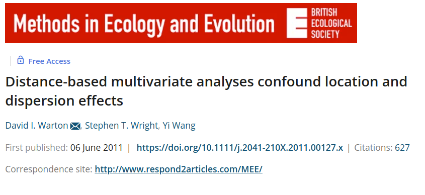

```{r setup, include=FALSE}
library(knitr)

default_source_hook <- knit_hooks$get('source')
default_output_hook <- knit_hooks$get('output')

knit_hooks$set(
  source = function(x, options) {
    paste0(
      "\n::: {.codebox data-latex=\"\"}\n\n",
      default_source_hook(x, options),
      "\n\n:::\n\n")
  }
)

knit_hooks$set(
  output = function(x, options) {
    paste0(
      "\n::: {.codebox data-latex=\"\"}\n\n",
      default_output_hook(x, options),
      "\n\n:::\n\n")
  }
)

knitr::opts_chunk$set(echo = TRUE)
```

# Gradient analysis


## Ordination

Goodall (1954) introduced the word "ordination"

1) Ordination summarizes data
2) Ordination **embeds** in a low-dimensional space
3) Ordination **orders** samples and species

## Gradients


- environmental gradient
- ecological gradient
- other gradients

## Latent variables


\centering

**In essence: an unobserved gradient**

## Ecological gradients

\vspace*{\baselineskip}

"Few major complex ecological gradients normally account for most of the variation in species composition."  \tiny (Halvorsen, 2012) \normalsize

## Ordination plot

```{r ord1, echo = FALSE, fig.height = 6, warning=FALSE, fig.align="center"}
mu1 <- -1
mu2 <- 0.5
mu11 <- 1
mu21 <- 1.5
parold<-par()
par(mar=c(5, 5, 0.5, 2) + 0.1)
plot(c(mu1,mu2),c(mu11,mu21),xlab="Dimension 1", ylab="Dimension 2",xaxt="n",yaxt="n",xlim=c(-2,2),ylim=c(-2,2), cex.lab=1.8,type = "n")
abline(v=0,h=0,col="red",lty="dashed", lwd = 1.5)
points(x=mu1,y=mu11,pch=20,col="blue",cex=3)
text(x=mu1,y=mu11,labels = "Species 1",col="blue",pos = 3, cex = 2)
points(x=mu2,y=mu21,pch=20,col="green",cex=3)
text(x=mu2,y=mu21,labels = "Species 2",col="green",pos = 3, cex = 2)
box()
text(-1,1.5,labels=1,col="black", cex = 2)
text(0,2,labels=2,col="black", cex = 2)
text(1,-1,labels=3,col="black", cex = 2)
text(1.2,1.5,labels=4,col="black", cex = 2)
text(-1.5,-1.5,labels=5,col="black", cex = 2)
library(shape)
par(parold)
```

## Ordination plot

```{r ord2, echo = FALSE, fig.height = 6, warning=FALSE, fig.align="center"}
mu1 <- -1
mu2 <- 0.5
mu11 <- 1
mu21 <- 1.5
parold<-par()
par(mar=c(5, 5, 0.5, 2) + 0.1)
plot(c(mu1,mu2),c(mu11,mu21),xlab="Dimension 1", ylab="Dimension 2",xaxt="n",yaxt="n",xlim=c(-2,2),ylim=c(-2,2), cex.lab=1.8,type = "n")
abline(v=0,h=0,col="black",lty="dashed", lwd = 1.5)
points(x=mu1,y=mu11,pch=20,col="blue",cex=3)
text(x=mu1,y=mu11,labels = "Species 1",col="blue",pos = 3, cex = 2)
points(x=mu2,y=mu21,pch=20,col="green",cex=3)
text(x=mu2,y=mu21,labels = "Species 2",col="green",pos = 1, cex = 2)
text(-1,1.5,labels=1,col="black", cex = 2)
text(0,2,labels=2,col="black", cex = 2)
text(1,-1,labels=3,col="black", cex = 2)
text(1.2,1.5,labels=4,col="black", cex = 2)
text(-1.5,-1.5,labels=5,col="black", cex = 2)
arrows(x0=0,y0=0,x1=0.2,y1=0.2, length=0.3, col = "red", lwd = 1.5)
arrows(x0=0,y0=0,x1=-0.5,y1=0.5, length=0.3, col = "red", lwd = 1.5)
arrows(x0=0,y0=0,x1=0.1,y1=-2, length=0.3, col = "red", lwd = 1.5)

library(shape)
par(parold)
```

## Ordination plot

We use it to:

- Get a quick overview of patterns in the data
- Describe species **co-occurrence** patterns

\pause

Species that are far away: negative association\newline
Species that are closeby: positive association

## When to use ordination

Mostly when we want to do dimension reduction. But also when:

\begin{enumerate}
\item We want to estimate latent variables
\begin{itemize}
\item Especially when we have not measured the environment
\end{itemize}
\item \alt{We do not have enough data to estimate species effects}{\textbf{We do not have enough data to estimate species effects}}
\item We want to make pretty pictures
\end{enumerate}

## Classification of ordination 

\begin{center}
\textbf{\textcolor{red}{There are many ways to group ordination methods}}
\end{center}

- Indirect or direct
- Linear or unimodal
- Unconstrained or constrained
- Simple-method or distance-based

## Gradient analysis

Indirect gradient analysis: patterns in species composition that may be due to environment, but without studying environmental variables \newline
Direct gradient analysis: estimate how species are affected by environmental variables\newline

Both are used to analyze patterns in ecological communities

## Linear or Unimodal

Ordination (where does the concept come from)

- arranging samples
- three models according to classical methods; linear, unimodal, neither

\vspace{-\baselineskip}

```{r, echo = FALSE, message=FALSE, warning=FALSE, fig.height = 5}
library(coenocliner)
set.seed(42)
N <- 100 # Number of locations on gradient (samples)
glen <- 4 # Gradient length
grad <- sort(runif(N, -glen/2, glen/2)) # sample locations
M <- 10 # Number of species
sim <- simJamil(n = N, m = M, x = grad, gl = glen, randx = FALSE,
                randm = FALSE, expectation = TRUE)
## visualise the response curves
matplot(grad, sim, type = "l", lty = "solid", xlab= "Gradient", ylab = "Probability of occurrence")
## simulate binomial responses from those response curves
sim <- simJamil(n = N, m = M, x = grad, gl = glen, randx = FALSE,
                randm = FALSE)
```

## Unconstrained or constrained

a) Unconstrained ordination: explore main drivers of variation \newline (i.e., indirect gradient analysis)
b) Constrained ordination: filter variation due to covariates \newline (i.e., gradient analysis)
c) \textcolor{grey}{(Concurrent ordination)}

Unconstrained is mostly descriptive, constrained can also be used for hypothesis testing.\newline
Both can be understood as estimating latent variables.\newline
Note: method is different from the figure, but usually referred to with same/similar names

## Ordination as latent variable models

Some ordination methods can be thought of as implementing a latent variable model

- [ter Braak (1985)](https://www.jstor.org/stable/2530959?origin=crossref)
- Jongman et al. (1995)
- [van der Veen et al. (2022, section 3 chapter 1)](https://ntnuopen.ntnu.no/ntnu-xmlui/handle/11250/2980780)

They approximately implement:

\begin{equation}
y_{ij} = \beta_{0j} + \textbf{z}_i^\top\symbf{\theta}_j
\end{equation}

This makes for better comparison with GLLVMs

# Unconstrained

## Classical ordination

Traditionally the go-to method for multivariate analysis

**From $p$ columns to $d << m$ dimensions**

- Principal Component Analysis \footnotesize (PCA; Pearson 1901)
- Factor Analysis \footnotesize (FA; Spearman 1904)
- Correspondence Analysis \footnotesize (CA; Hirschfeld 1935)
- Non-metric Multidimensional Scaling \footnotesize (NMDS; Kruskal 1964a,b)
- Principal Coordinate Analysis \footnotesize (PCoA; Gower 1967)
- Detrended Correspondence Analysis \footnotesize (DCA; Hill and Gauch 1980)

## Problems with classical methods

```{r, out.width="70%",fig.align="center", echo = FALSE} 
knitr::include_graphics("central.png")
```

```{r, out.width="70%",fig.align="center", echo  =FALSE} 

```

## From JSDM to latent variable model

JSDMs focus on species, but is an ordination:

\begin{equation}
g\{\mathams{E}(\textbf{y}_i \vert \symbf{\epsilon}_i)\} = \symbf{\beta}_0 + \symbf{\epsilon}_i, \qquad \text{ where } \symbf{\epsilon}_i = \textbf{z}_i^\top\symbf{\Gamma}^\top
\end{equation}

- $\textbf{z}_i$ are site scores; coordinates in the ordination
- $\symbf{\Gamma}$ is a matrix of species loadings; it forms the associations

\pause

\textcolor{red}{
\begin{enumerate}
\itemsep-0.5em 
\item Ordination and JSDM use the same statistical framework
\item The models take a different angle
\item JSDM \textbf{can} be an LVM, ordination \textbf{is} an LVM
\end{enumerate}
}

## A new approach!..or is it?

\begin{itemize}
\itemsep-0.5em
\item Community ecology has been doing it for a hundred years
\item e.g. Forbes (1907) or Goodall (1954)
\item Walker and Jackson (2011): Random-effects ordination!
\item Hui et al. (2015): Model-based unconstrained ordination
\end{itemize}

```{r out.width="70%",fig.align="center", echo = FALSE} 

```

## 

\centering

```{r, out.width = "100%", out.height="100%", echo = FALSE}
knitr::include_graphics("walker.png")
```

```{r, out.width = "100%", out.height="100%", echo = FALSE}
knitr::include_graphics("modelbased.png")
```

## Generalized Linear Latent Variable Model

- Still a mixed-effects model (so can incorporate random effects)
- $d$ latent variables, usually treated as random-effect
- Produces ordination
  - No varimax rotation
  - Much more flexible
  - Clear link with the original data, no distances
- We can use tools from ordination and regression  

## JSDM vs. ordination

\centering

\textcolor{red}{JSDMs build more heavily on SDMs than on traditional multivariate analysis} \vspace*{0.5\baselineskip}
\textcolor{red}{Ordination methods have been criticised for being too
descriptive rather than predictive nature}\newline
\hfill\footnotesize Ovaskainen and Abrego 2021 \normalsize

\pause

<!-- **but JSDMs leverage from FA, an ordination method, and they do not even cite Walker and Jackson 2011** \newline -->
**ordination did it first** \footnotesize Walker and Jackson 2011 \normalsize

## JSDM vs. ordination

The differences is in how we think of the model:

- Do we formulate on the basis of latent variables or associations
- Do we look at patterns in the ordination, or patterns on a map?
- Do we believe the "axes" have meaning, or not?
- The scale at which we operate: local or marcoecological
- Is the **the sampling process** considered?

\pause

\centering

\textcolor{red}{Both of the angles have a lot to teach us about community ecology}

## Unconstrained ordination

\centering

```{r, out.width="31%",out.height="31%", echo = FALSE}
knitr::include_graphics("modelbased_francis1.jpg")
knitr::include_graphics("modelbased_francis2.jpg")
```

```{r, out.width="50%",out.height="50%", echo = FALSE}

```

\footnotesize Figures from **Hui et al. 2015**

# Example 1

Wadden sea data [Dewenter et al. (2023)](https://onlinelibrary.wiley.com/doi/full/10.1002/ece3.10815)

\begin{columns}
\column{0.5\textwidth}
\begin{itemize}
\item Abundance (counts) or Biomass of macrozoobenthos
\item Covariates
\item Transects at islands (Norderney, Spiekeroog, Wangerooge)
\end{itemize}
\column{0.5\textwidth}
\begin{figure}[h]
\centering
\includegraphics{macrozoobenthos.jpg}
\caption{nioz.nl}
\end{figure}
\end{columns}

\tiny

```{r dat, echo = -4}
Ya <- read.csv("../data/waddenY.csv")[,-c(1:2)];
Ya <- Ya[, colSums(ifelse(Ya==0,0,1))>2]
X <- read.csv("../data/waddenX.csv")
X <- X[,!apply(X,2,anyNA)]
X[,unlist(lapply(X,is.numeric))] <- scale(X[,unlist(lapply(X,is.numeric))])
```

## Study design

{height=90%}

## Unconstrained ordination

\footnotesize

```{r uord, echo = c(-1,-3,-5), out.width="49%", fig.show="hold",message=FALSE, warning=FALSE, results = FALSE, cache = TRUE, fig.height = 10}
uord1 <- gllvm::gllvm(Ya, num.lv = 2, family = "poisson")
plot(uord1, which = 2, caption = "Poisson", cex = 2, cex.lab = 2, cex.axis = 2)
uord2 <- gllvm::gllvm(Ya, num.lv = 2, family = "negative.binomial")
plot(uord2, which = 2, caption = "Negative binomial", cex = 2, cex.lab = 2, cex.axis = 2)
```

## Group-level unconstrained ordination

\footnotesize

```{r cord12, echo = c(-2, -4), out.width="49%", warning=FALSE, message=FALSE, results = FALSE, cache = TRUE, fig.show="hold"}
uord3 <- gllvm::gllvm(Ya, X = X, 
         num.RR = 2, lv.formula = ~diag(1|island), randomB = "LV", 
         family = "negative.binomial", disp.formula = rep(1,ncol(Ya)))
gllvm::ordiplot(uord3, symbols=TRUE, pch=X$island, arrow.scale=0, s.cex = 2, cex.main = 2, cex.axis = 2, cex.lab = 2,s.colors = as.character(factor(X$island,labels  = c("blue", "green", "black"))))
uord4 <- gllvm::gllvm(Ya, X = X, 
         num.RR = 2, lv.formula = ~diag(1|island/transect), randomB = "LV", 
         family = "negative.binomial", disp.formula = rep(1,ncol(Ya)), starting.val = "zero")
gllvm::ordiplot(uord4, symbols=TRUE, pch=X$island, s.colors =col, arrow.scale=0, s.cex = 2, cex.main = 2, cex.axis = 2, cex.lab = 2, main = NA,rotate=FALSE)
```

## Quadratic unconstrained ordination

\footnotesize

```{r cord3, echo = -2, fig.height = 5, warning=FALSE, message=FALSE, results = FALSE, fig.show="hold", cache = TRUE}
uord5 <- gllvm::gllvm(Ya, X = X, quadratic = TRUE, 
         num.RR = 2, lv.formula = ~diag(1|island/transect), randomB = "LV", 
         family = "negative.binomial", disp.formula = rep(1,ncol(Ya)), starting.val = "zero")
gllvm::ordiplot(uord5, symbols=TRUE, pch=X$island, s.colors = as.character(factor(X$island,labels  = c("blue", "green", "black"))), arrow.scale=0, cex.env = 1, main = NA)
```

# Residual ordination

## Residual ordination

Any effect not "in" the ordination (but in the model) "filters" the ordination (i.e., conditioning)

- We might want to account for pseudo-replication (transect as in the example)
- Exclude the effect of some "confounder"
- When we do not have enough data to estimate all effects outside of the ordination, but some

## Residual ordination: the model

\begin{equation}
\tikzmarknode{t1}{\highlight{red}{\eta_{ij}}}
= 
\tikzmarknode{t2}{\highlight{blue}{\beta_{0j}}}
+
\tikz[baseline,remember picture]{
\node[anchor=base,rectangle, draw=grey, fill=grey!17, dashed] (t34) {$
\tikzmarknode{t3}{\highlight{grey}{\textbf{x}_i^\top}}
\tikzmarknode{t4}{\highlight{grey}{\symbf{\beta}_j}}
$}
}
+
\tikzmarknode{t5}{\highlight{yellow}{\textbf{z}_i^\top}}
\tikzmarknode{t6}{\highlight{green}{\symbf{\gamma}_j}}
\end{equation}

\tikzmarknode{n1}{Covariates with species-specific coefficients ("conditioning")}

\begin{tikzpicture}[overlay,remember picture]
        \draw[->] (n1) -| ([xshift=0.1cm]n1.east) |- ([xshift=0.1cm, yshift = 0.3cm]n1.east) -| (t34);
\end{tikzpicture}

- No longer an unconstrained ordination: covariates are involved
- For binary data it is a JSDM (more later)
- We can also use it to adjust the ordination (take an effect out)
- We estimate species-specific effect $\symbf{\beta}_j$ so need a good amount of data

## Example with Wadden data: conditioning

\footnotesize

```{r resid, echo = c(-1, -3, -4), warning=FALSE, message=FALSE, results = FALSE, cache = TRUE, fig.show="hold", out.width="49%"}
uord6 <- gllvm::gllvm(Ya, X = X, formula = ~island,
         num.RR = 2, lv.formula = ~diag(1|island), randomB = "LV", 
         family = "negative.binomial", disp.formula = rep(1,ncol(Ya)))
gllvm::ordiplot(uord3, symbols=TRUE, pch=X$island, arrow.scale=0, s.cex = 2, cex.main = 2, cex.axis = 2, cex.lab = 2,s.colors = as.character(factor(X$island,labels  = c("blue", "green", "black"))), main = "No conditioning")
gllvm::ordiplot(uord6, symbols=TRUE, pch=X$island, arrow.scale=0, s.cex = 2, cex.main = 2, cex.axis = 2, cex.lab = 2,s.colors = as.character(factor(X$island,labels  = c("blue", "green", "black"))), main = "Conditioning on island")
```

## Residual ordination

In the same way, we can decide to "pull" any effect in or out of the ordination.


# Constrained

\textbf{Goal}: to determine if (how) environment affects community composition \newline
\textbf{Problem}: many possible drivers (if not, multivariate GLM would do the trick)

\columnsbegin
\column{0.6\textwidth}
\begin{itemize}
\item Why are sites different?
\item Why do species co-occur (or not)?
\item Which components of the environment are most important for the community?
\end{itemize}

\column{0.4\textwidth}
```{r, echo=F, eval=T, out.width="99%", fig.cap="ter Braak 1986"}
knitr::include_graphics("CCA.png")
```

\columnsend

## Constrained ordination 

```{r, echo=F, eval=T, out.width="60%", fig.cap="ter Braak 1986", fig.align="center"}
knitr::include_graphics("CCA.png")
```

Now three quantities: so we call this a **triplot**. The arrows show the association of covariates to the axes.

## Methods for constrained ordination 

\begin{itemize}
\item Redundancy Analysis \tiny (Rao 1964)  \normalsize
\item Canonical Correspondence Analysis \tiny (ter Braak 1986) \normalsize
\item RR-GLMs \tiny (Yee et al. 1996,2003,2010,2015) \normalsize
\item Row-column interaction models  \tiny (Hawinkel  et al. 2019) \normalsize
\item GLLVMs \tiny (van der Veen  et al. 2023) \normalsize
\end{itemize}

## Canonical Correspondence Analysis

- Although RDA was developed much earlier, CCA has been the leading constrained ordination method
- ter Braak (1986) developed CCA as a combination of ordination and regression
- Each axis is restricted (constrained) by covariate information
- CCA approximates Gaussian Ordination \tiny (i.e., to the unimodal model, Johnson and Altman, 1999) \normalsize

## Canonical Correspondence Analysis: arrows

The covariate coefficients $\textbf{B}$ are referred to as **canonical** coefficients.

- \texttt{vegan} does not use these for plotting
- Instead it uses sample correlation coefficients as recommended by ter Braak (1986)
- The canonical coefficients can be "unstable" due to multicollinearity
- In \texttt{gllvm}, we do use $\textbf{B}$ (more details later)

## Canonical Correspondence Analysis example

\footnotesize

```{r constr, fig.align="center", fig.height = 5}
cca <- vegan::cca(Ya~Condition(transect)+Condition(island)+
                    elevation+TOC+DIN+RDP+Chl.a+silt_clay+season, X)
vegan::ordiplot(cca)
```

\normalsize

## Different scores

The CCA algorithm gives raise to two sets of site scores:

1) Linear combination (LC) scores (similar to model-based constrained ordination)
2) Weighted average (WA) scores (similar to model-based concurrent ordination)

WA scores are usually recommended for plotting \tiny (Palmer, 1993) \normalsize

\pause

\centering
\textcolor{red}{I disagree}


## Constrained ordination

### In R e.g.

For constrained ordination:
\begin{itemize}
\item \texttt{vegan} - classical methods
\item \texttt{VGAM} - cool algorithm, faster than \texttt{gllvm}, but not so easy to use (and no random effects)
\item \texttt{gllvm} - easy to use
\end{itemize}

## Constrained ordination: the model

\begin{equation}
\tikzmarknode{t1}{\highlight{red}{\eta_{ij}}}
= 
\tikzmarknode{t2}{\highlight{blue}{\beta_{0j}}}
+
\tikzmarknode{t3}{\highlight{yellow}{\textbf{z}_i^\top}}
\tikzmarknode{t4}{\highlight{green}{\symbf{\gamma}_j}}
\end{equation}

So far, we have assumed that the latent variable is estimated by species information alone: $\textbf{z}_i =  \symbf{\epsilon}_i$ \pause \newline
Constrained ordination instead assumes that we also have covariates in the ordination: $\textbf{z}_i = \textbf{B}^\top\textbf{x}_i$

## Constrained ordination: the model

Plugging in  $\symbf{z}_i =  \symbf{\epsilon}_i$ we get:
\begin{equation}
\tikzmarknode{t1}{\highlight{red}{\eta_{ij}}}
= 
\tikzmarknode{t2}{\highlight{blue}{\beta_{0j}}}
+
\tikzmarknode{t3}{\highlight{yellow}{\textbf{x}_i^\top\symbf{B}}}
\tikzmarknode{t4}{\highlight{green}{\symbf{\gamma}_j}}
\end{equation}

From this we see that $\symbf{\beta}_j \overset{d}{\approx} \textbf{B}\symbf{\gamma}_j$

- These are the (reduced rank) approximated species-specific covariate coefficients
- We can extract these, and inspect them with statistical uncertainty
- So we use information across the whole community, to estimate species-specific responses

## Constrained ordination with \texttt{gllvm}

```{r, echo=F, eval=T, fig.align="center", out.width="55%"}
knitr::include_graphics("demonstration.jpg")
```

## Example with Wadden data

\footnotesize

```{r cord, cache = TRUE, echo = -c(1,3,4), fig.height = 4, warning = FALSE, message = FALSE}
par(mfrow=c(1,2))
cord <- gllvm::gllvm(y = Ya, X, num.RR = 2, family = "negative.binomial",
        lv.formula = ~elevation+TOC+DIN+RDP+Chl.a+silt_clay+season, 
        row.eff = ~(1|island/transect), studyDesign = X[, c("island","transect")],
        disp.formula = rep(1,ncol(Ya)))
gllvm::ordiplot(cord, biplot = TRUE, main  ="With species loadings") # can get weird placement due to insufficient data
gllvm::ordiplot(cord, main = "Without species loadings")
```

\normalsize

<!-- ## Example with Wadden data -->

<!-- \tiny -->

<!-- ```{r cord_sum} -->
<!-- summary(cord) -->
<!-- ``` -->

<!-- ## Example with Wadden data -->

<!-- \tiny -->

<!-- ```{r cord_sum2} -->
<!-- summary(cord, by = "terms") -->
<!-- ``` -->

These are to reduce the cognitive load, please do not stare at them \textbf{too} much.

## Example with Wadden data

\footnotesize

```{r cord_coefp, fig.align="center", fig.height = 5}
gllvm::coefplot(cord, which.Xcoef="elevation")
```

\normalsize

Species effects with 95% confidence interval

## Constrained ordination

- Species effects can be retrieved for any covariate
- Extreme results occur, usually due to insufficient data
- GLLVMs picks up on extreme clustering -very- well

## Constrained ordination

The first implementation of CO that can be combined with random effects

- Random site effects (outside ordination)
- Random canonical coefficients (more in a few slides)

## Common misconception

\textcolor{red}{Post-hoc relating unconstraied ordination axes to environmental covariates is \textbf{not} equivalent to a constrained ordination}

Also it is bad practice: please do not do it. Instead \textbf{adjust your model}.

## Hybrid ordination

- Incorporate both constrained and unconstrained ordination
- But without explicit connection
- Default in \texttt{vegan} and you can also do it in \texttt{gllvm} (use both `num.RR` and `num.lv`)

# Concurrent

- In practice, constrained and unconstrained ordination are often combined into an analysis \newline

- Variation not due to the environment is discared, while potentially of large importance

- \textit{Concurrent ordination} is a new type of ordination method that combines unconstrained and constrained ordination

## Concurrent ordination

\textit{Concurrent:'existing or happening at the same time'} \tiny (Oxford's dictionary) \normalsize

\only<2>{
\begin{enumerate}
\itemsep-0.5em
\item Suggested in van der Veen et al. (2023)
\item Performs both unconstrained and constrained ordination \textbf{simultaneously}\newline
\item Ordination axes have \textbf{measured} and \textbf{unmeasured} components
\item Covariates \textit{inform} rather than \textit{constrain}
\item Separates out drivers of community composition
\end{enumerate}
}

## Concurrent ordination: \alt<6>{site scores}{the model}

\begin{equation}
\tikzmarknode{t1}{\highlight{red}{\eta_{ij}}}
= 
\tikzmarknode{t2}{\highlight{blue}{\beta_{0j}}}
+
\tikzmarknode{t3}{\highlight{yellow}{\textbf{z}_i^\top}}
\tikzmarknode{t4}{\highlight{green}{\symbf{\gamma}_j}}
\end{equation}

The model is flexible, $\tikzmarknode{n1}{\textbf{z}_i}$ can be all kinds of things.

\begin{tikzpicture}[overlay,remember picture]
        \draw[->] (t3) |- ([yshift = 0.5cm]n1.north) -- (n1);
        \draw<2->[->] (n1) |- ([xshift = -0.8cm]n2.north west) |- ([xshift = -0.5cm]n2.west);
        \draw<3->[->] ([xshift = -0.8cm]n2.north west) |- ([xshift = -0.5cm]n3.west);
        \draw<4->[->] ([xshift = -0.8cm]n3.north west) |- ([xshift = -0.5cm]n4.west);
\end{tikzpicture}

\begin{enumerate}
\item<2-6> $\tikzmarknode{n2}{\highlight{yellow}{\textbf{z}_i}} = \symbf{\epsilon}_i,$ \alt<6>{\textcolor{red}{residual}}{\textbf{unconstrained}}
\item<3-6> $\tikzmarknode{n3}{\highlight{yellow}{\textbf{z}_i}} = \textbf{B}^\top\textbf{x}_i,$ \alt<6>{\textcolor{red}{marginal}}{\textbf{constrained}}
\item<4-6> $\tikzmarknode{n4}{\highlight{yellow}{\textbf{z}_i}} = \textbf{B}^\top\textbf{x}_i + \symbf{\epsilon}_i,$ \alt<6>{\textcolor{red}{conditional}}{\underline{\textbf{concurrent}}}
\item<5-6>[] Often unconstrained and concurrent ordinations are similar
\end{enumerate}

## Concurrent ordination: the model

\begin{center}
\textcolor{red}{Essentially a linear mixed-effects model of the latent variable $\textbf{z}_i$}
\scriptsize{(hiearchcally)}
\end{center}

## Concurrent ordination with \texttt{gllvm}

```{r, echo=F, eval=T, fig.align="center", out.width="55%"}
knitr::include_graphics("demonstration.jpg")
```

## Example with Wadden data

\footnotesize

```{r cnord, cache = TRUE, warning = FALSE, message = FALSE}
cnord <- gllvm::gllvm(y = Ya, X, num.lv.c = 2, family = "negative.binomial",
         lv.formula = ~elevation+TOC+DIN+RDP+Chl.a+silt_clay+season, 
         row.eff = ~(1|island/transect), studyDesign = X[, c("island","transect")],
         disp.formula = rep(1,ncol(Ya)), n.init = 3)
coef(cnord, parm="Cancoef")
```

## Example with Wadden data

```{r cnord_ordi, cache = FALSE, warning = FALSE, message = FALSE, dev="png", fig.show = "hide", fig.height = 7, dpi = 150}
layout(matrix(c(1,1,2,3), 2, 2, byrow=TRUE))
gllvm::ordiplot(cnord, type= "conditional", rotate = FALSE) 
gllvm::ordiplot(cnord, type = "marginal", rotate = FALSE) 
gllvm::ordiplot(cnord, type = "residual", rotate = FALSE)
```

## Example with Wadden data

\centering

`)


## Random canonical coefficients

We can treat the canonical coefficients as random with `randomB`

- This is usually faster
- Treats the "bouncing beta" problem
- Models correlation between species due to environment

1) LV: canonical coefficients of the same ordination axis come from the same distribution
  - Shrinkage over LVs
2) P: canonical coefficients of the same covariate come from the same distribution
  - Shrinkage over covariates
3) single: all come from the same distribution


## Random canonical coefficients

We can also incorporate \textbf{correlation} of the effects. This is a model where we have:

- Associations due to environment `getEnvironCor`
- Correlation between environment effects (requires `lv.formula` lme4-style)
- Which means we can examine the reduced-rank approximated random effects `RandomCoefPlot``

## Example with Wadden data

\footnotesize

```{r cnord2, cache = TRUE, warning = FALSE, message = FALSE}
cnord2 <- gllvm::gllvm(y = Ya, X = X, num.lv.c = 2, randomB = "LV",
          family = "negative.binomial",
          lv.formula = ~elevation+TOC+DIN+RDP+Chl.a+silt_clay+season, 
          row.eff = ~(1|island/transect), studyDesign = X[, c("island","transect")],
          disp.formula = rep(1,ncol(Ya)), n.init = 3)
```

\normalsize

or random-effects style (correlation for effects in same brackets):

\footnotesize

```{r cnord2b, cache = TRUE, warning = FALSE, message = FALSE, eval = FALSE}
cnord2b <- gllvm::gllvm(y = Ya, X = X, num.lv.c = 2, randomB="LV",
           family = "negative.binomial",
           lv.formula = ~(0+elevation+TOC+DIN+RDP+Chl.a+silt_clay+season|1), 
           row.eff = ~(1|island/transect), studyDesign = X[, c("island","transect")],
           disp.formula = rep(1,ncol(Ya)), n.init = 3)
```

\normalsize

## Example with Wadden data

```{r cnord2_ordiplot, cache = TRUE, warning = FALSE, message = FALSE, fig.height = 7, echo = FALSE, dpi = 150}
layout(matrix(c(1,1,2,3), 2, 2, byrow=TRUE))
gllvm::ordiplot(cnord2, type= "conditional", rotate = FALSE) 
gllvm::ordiplot(cnord2, type = "marginal", rotate = FALSE) 
gllvm::ordiplot(cnord2, type = "residual", rotate = FALSE)
```

## Example with Wadden data

```{r cnord2_rancoef, cache = TRUE, warning = FALSE, message = FALSE, fig.height = 5, fig.align="center"}
gllvm::randomCoefplot(cnord2, which.Xcoef="elevation")
```

# Summary

## Summary

- Ordination has four flavours in GLLVM:
  - Unconstrained ordination
  - Residual ordination
  - Constrained ordination
  - Concurrent ordination (combining unconstrained and constrained)
- Random (correlated) canonical coefficients via the `randomB` argument 
- Partial ordination by adding (fixed or random) effects via `formula`
- Or conditioning on species-common (fixed or random) effects via `row.eff``

## How to choose

\centering

It all depends what we want out of an ordination.

\pause

- Exploratory analysis of the community: unconstrained ordination
- Species-environment relationships: 
  - residual or constrained ordination
  - concurrent or hybrid ordination
- Associations
  - Residual: unconstrained, residual or concurrent ordination
  - Environmental: constrained or concurrent ordination

\hfill {width=50%}
