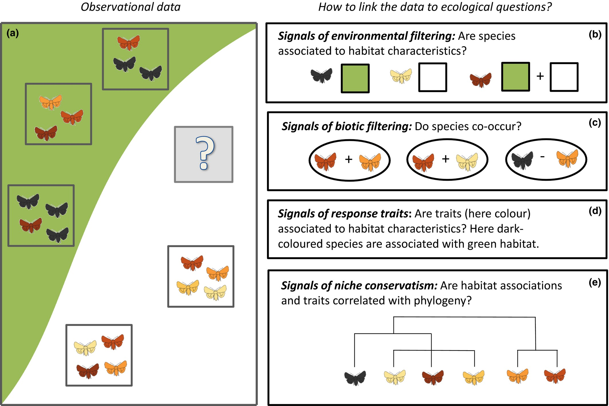

```{r setup, include=FALSE}
library(knitr)

default_source_hook <- knit_hooks$get('source')
default_output_hook <- knit_hooks$get('output')

knit_hooks$set(
  source = function(x, options) {
    paste0(
      "\n::: {.codebox data-latex=\"\"}\n\n",
      default_source_hook(x, options),
      "\n\n:::\n\n")
  }
)

knit_hooks$set(
  output = function(x, options) {
    paste0(
      "\n::: {.codebox data-latex=\"\"}\n\n",
      default_output_hook(x, options),
      "\n\n:::\n\n")
  }
)

knitr::opts_chunk$set(echo = TRUE)
```

# Introduction

## Outline of this session

- GLMs assume independence
- Mixed-effects can relax that assumption
- Also allow to incorporate correlation (between species)
  - I.e., JSDM

## Outline

- Data collection and common data types
- Generalised Linear Models background
  - Assumption checking 
- "Vector" models
- GLMMs
  - Estimating variation in species responses
  - Estimating correlation in species responses
- Model diagnostics and selection

- Building on some material from [the GLM workshop](https://github.com/BertvanderVeen/GLM-workshop)

## Philosophy

- Adjust the model, not the data
- If you're not sure how to adjust the model, you just need to figure out
- Unlike "classically" where the data is adjusted to make the method fit

## Classical approach

\columnsbegin
\column{0.5\textwidth}

Classically:

1) Decide on a distance
2) Apply a multivariate analysis
3) Make a plot
4) Do a hypothesis test

\column{0.5\textwidth}


\columnsend

## Statistical modeling

Instead of a focus on data, we consider the \textit{data generating process}

- We collect data
- Decide on a research question for \textit{the population}
- Learn about the variation in the data
  - Which requires formulating a model
- Work out distribution of the estimates
  - And find the "best" estimate
- Conclude if our answer is robust for the population

# Collecting data

-maybe make this about data properties
- we can design the ideal dataset and it would always give us the correct answer
- sometimes, things don't work out so well and there are properties that "hide" the true ecological process

## Data collection

{width=80%}

A meadow in the Dutch dunes.  \newline

How do we find the total number of species?

## How many plant species are there in this meadow?

\columnsbegin
\column{0.4\textwidth}

\column{0.6\textwidth}

```{r, cache = TRUE, echo = FALSE, fig.height = 4, fig.width = 4}
plot(0:10,0:10,xaxt="n",yaxt="n", type="n", xlab = NA, ylab=NA, xlim=c(0,10),ylim=c(0,10), yaxs="i", xaxs="i")
box(lwd=5)
abline(h=c(2,4,6,8,10), lwd = 2);abline(v=c(2,4,6,8,10), lwd = 2)
points(sample(seq(0,10,length.out=1000), 20, replace = TRUE),sample(seq(0,10,length.out=1000), 20, replace = TRUE), pch = 16, col = sample(1:4, 20, replace = TRUE), cex = 3)
```

\columnsend

\vspace*{-2\baselineskip}

We go into the meadow and count plants in quadrats. We find 4 species.

## Resampling the dunes

\columnsbegin
\column{0.5\textwidth}
```{r, cache = TRUE, echo = FALSE, fig.height = 5, fig.width = 5, out.width = "50%", fig.align = "right"}
plot(0:10,0:10,xaxt="n",yaxt="n", type="n", xlab = NA, ylab=NA, xlim=c(0,10),ylim=c(0,10), yaxs="i", xaxs="i")
box(lwd=5)
abline(h=c(2,4,6,8,10), lwd = 2);abline(v=c(2,4,6,8,10), lwd = 2)
points(sample(seq(0,10,length.out=1000), 20, replace = TRUE),sample(seq(0,10,length.out=1000), 20, replace = TRUE), pch = 16, col = sample(c(1,3,6), 20, replace = TRUE), cex = 3)
```
\column{0.5\textwidth}

```{r, cache = TRUE, echo = FALSE, fig.height = 5, fig.width = 5, out.width = "50%", fig.align = "left"}
plot(0:10,0:10,xaxt="n",yaxt="n", type="n", xlab = NA, ylab=NA, xlim=c(0,10),ylim=c(0,10), yaxs="i", xaxs="i")
box(lwd=5)
abline(h=c(2,4,6,8,10), lwd = 2);abline(v=c(2,4,6,8,10), lwd = 2)
points(sample(seq(0,10,length.out=1000), 20, replace = TRUE),sample(seq(0,10,length.out=1000), 20, replace = TRUE), pch = 16, col = sample(3:6, 20, replace = TRUE), cex = 3)
```
\columnsend

\columnsbegin
\column{0.5\textwidth}

```{r, cache = TRUE, echo = FALSE, fig.height = 5, fig.width = 5, out.width = "50%", fig.align = "right"}
plot(0:10,0:10,xaxt="n",yaxt="n", type="n", xlab = NA, ylab=NA, xlim=c(0,10),ylim=c(0,10), yaxs="i", xaxs="i")
box(lwd=5)
abline(h=c(2,4,6,8,10), lwd = 2);abline(v=c(2,4,6,8,10), lwd = 2)
points(sample(seq(0,10,length.out=1000), 20, replace = TRUE),sample(seq(0,10,length.out=1000), 20, replace = TRUE), pch = 16, col = sample(1:6, 20, replace = TRUE), cex = 3)
```

\column{0.5\textwidth}

```{r, cache = TRUE, echo = FALSE, fig.height = 5, fig.width = 5, out.width = "50%", fig.align = "left"}
plot(0:10,0:10,xaxt="n",yaxt="n", type="n", xlab = NA, ylab=NA, xlim=c(0,10),ylim=c(0,10), yaxs="i", xaxs="i")
box(lwd=5)
abline(h=c(2,4,6,8,10), lwd = 2);abline(v=c(2,4,6,8,10), lwd = 2)
points(sample(seq(0,10,length.out=1000), 20, replace = TRUE),sample(seq(0,10,length.out=1000), 20, replace = TRUE), pch = 16, col = sample(1:2, 20, replace = TRUE), cex = 3)
```

\columnsend

We resample the dune meadow, and find different numbers of species: 3, 3, 6, 2. And different compositions. On average we have found 3.5 species per quadrat.

## Sampling variation

1) Each time we sample, we have a slightly different sample
2) Each time we estimate a parameter, it might be slightly different due to this sampling variation
3) The more data we sample, the better we can represent this variability of our estimate
4) And the better we can infer the ecological process that generates patterns of richness/cover in the meadow

<!-- ## Sampling variation -->

<!-- ```{r, cache = TRUE, echo = FALSE, fig.height = 5, fig.width = 5, out.width = "5%", fig.align = "center", fig.show = "hold"} -->
<!-- for(i in 1:112){ -->
<!-- plot(0:10,0:10,xaxt="n",yaxt="n", type="n", xlab = NA, ylab=NA, xlim=c(0,10),ylim=c(0,10), yaxs="i", xaxs="i") -->
<!-- box(lwd=5) -->
<!-- abline(h=c(2,4,6,8,10), lwd = 2);abline(v=c(2,4,6,8,10), lwd = 2) -->
<!-- points(sample(seq(0,10,length.out=1000), 20, replace = TRUE),sample(seq(0,10,length.out=1000), 20, replace = TRUE), pch = 16, col = sample(1:6, 20, replace = TRUE), cex = 3) -->
<!-- } -->
<!-- ``` -->

<!-- If we sample many times, we have an accurate picture of the whole meadow (and variability in the number of species in a quadrat that we might find). -->

<!-- ## Sampling variation -->

<!-- \begin{columns} -->
<!-- \column{0.5\textwidth} -->

<!-- \justify{ -->
<!-- If we sample in one large (field-sized) quadrat we also have an accurate picture of the whole meadow (and variability in the number of species in a quadrat that we might find).} -->

<!-- \column{0.5\textwidth} -->

<!-- ```{r, cache = FALSE, echo = FALSE, fig.height = 4, fig.width = 4, fig.align="center"} -->
<!-- par(mar=c(0,0,0,0)) -->
<!-- plot(0:100,0:100,xaxt="n",yaxt="n", type="n", xlab = NA, ylab=NA, xlim=c(0,100),ylim=c(0,100), yaxs="i", xaxs="i") -->
<!-- box(lwd=3) -->
<!-- abline(h=seq(0,100,2), lwd = 0.5);abline(v=seq(0,100,2), lwd = 0.5) -->
<!-- points(sample(seq(0,100,length.out=1000), 2000, replace = TRUE),sample(seq(0,100,length.out=1000), 2000, replace = TRUE), pch = 16, col = sample(1:6, 2000, replace = TRUE), cex = 0.5) -->
<!-- ``` -->

<!-- \end{columns} -->

## The ecological process

What do we know of the processes that generate these data?

- Meta-community theory
- Assembly processes (filtering)
- Ecological gradient theory

\pause

Multispecies models provide a statistical connection to these ecological frameworks. We do not just use a fancy tool, we use a fancy tool because we believe it aligns well with our understanding of the ecological process.

## The ecological process (2)

{height=60%}


## On ecological communities

The concept of an ecological community is of limited use. By definition:

**An ecological community is a group or association of two or more species occupying the same geographical area at the same time**

- We often think of ecological communities as groups
- We can also think of a community as a continuum that changes along a gradient \tiny (Austun 1985) \normalsize
- We can also think of them as the species in our data

\pause

Connecting model outputs to ecological concepts requires some deep thoughts

## Multispecies models

There are multiple statistical frameworks for studying the processes:

- Generalised Linear Models
- Generalised Linear Mixed-effects Models
- Generalised Additive Models \tiny (not covered here) \normalsize
- Generalised Linear Latent Variable Models

\pause

Or ecologically:

- Species distribution models
- Joint Species Distribution Models
- Ordination

\pause

and more. Each method has its limitations (assumptions). It is up to us to assess which are appropriate.

# GLMs

## Generalised linear models (GLMs)

GLMs as a framework were introduced by Nelder and Wedderburn (1972) uniting many different models. With a special focus on teaching statistics.

- Linear regression
- Logistic regression
- Probit regression
- Complementary log-log regression
- Log-linear regression
- Gamma regression

## Generalised linear models

\columnsbegin
\column{0.5\textwidth}

GLMs extend the linear model framework
to address:

\begin{itemize}
\item Variance changes with the mean
\item Range of \textbf{y} is bounded
\end{itemize}
\column{0.5\textwidth}

{width=80%}

\columnsend
\textbf{The basis of many statistical models in Ecology}

## Components of a GLM

- \textcolor{red}{Systematic component: $\eta$}
- \textcolor{blue}{Random component: data/distribution)}
- The link function: connects these components
  - This is not a data transformation
- The variance function

## GLM Likelihood

- We use MLE for estimation
- With a distribution in the "exponential family" (for fixed $\phi$)

All GLMs have the likelihood:

\begin{equation}
\mathcal{L}(y_i;\Theta) = \text{exp}\{\frac{y_i\textcolor{red}{\eta_i}-b(\textcolor{red}{\eta_i})}{a(\phi)} + c(y_i,\phi)\}
\end{equation}

## Generalised linear model

\begin{equation}
\begin{aligned}
 g\{\mathams{E}(y_i\vert x_i)\} &= \eta_i = \alpha + x_i\beta\\
 \mathams{E}(y_i\vert x_i) &= g^{-1}(\eta_i) = g^{-1}(\alpha + x_i\beta)
 \end{aligned}
\end{equation}

$\text{g}(\cdot)$ is the **link function**

## The link function

<!-- A smooth function with an inverse. -->

\columnsbegin
\column{0.5\textwidth}
- Is a smooth/monotone function
- Has an inverse $g^{-1}(\cdot)$
- Restricts the scale
- $\text{g}(\cdot)$ can be e.g.

\column{0.5\textwidth}

```{r, echo = FALSE, out.height="90%"}
x<-seq(binomial(link=logit)$linkinv(-5),binomial(link=logit)$linkinv(5),length.out=1000)
plot(x=binomial()$linkfun(x),x, cex.main = 5, cex.lab = 5, ylim = c(0,1), xlim = c(-5,5), type = "l", xlab=NA, ylab=NA, xaxt="n", yaxt="n")
abline(v=0,h=0,lty="dashed")
text(-3,.8,"Logit", cex=5)
```
\columnsend
\vspace*{-1.840\baselineskip}
\columnsbegin
\column{0.5\textwidth}

```{r, echo = FALSE, fig.align="center"}
x<-seq(poisson(link=log)$linkinv(-5),poisson(link=log)$linkinv(5),length.out=1000)
plot(x=poisson(link=log)$linkfun(x),x, cex.main = 5, xlim = c(-5,5), type = "l", xlab=NA, ylab=NA, xaxt="n", yaxt="n")
abline(v= 0, h = 0, lty="dashed")
text(-3,125,"Log", cex=5)
```

\column{0.5\textwidth}

```{r, echo = FALSE, fig.align="center"}
x<-seq(-5,5,length.out = 1000)
plot(x=x, 1/x, cex.main = 5, xlim =  c(-5,5),type = "l", xlab=NA, ylab=NA, xaxt="n", yaxt="n")
abline(v= 0, h = 0, lty="dashed")
text(-3,125,"Inverse", cex=5)
```

\columnsend

\vfill

## Assumptions

- No outliers
- Independence
- Correct distribution (in the EF)
- Correct link function
- Correct variance function (implied by previous two)

\textcolor{red}{We can check the validility of these assumptions with residual plots.}

## Often used distributions in ecology

- Binomial: occurrence/counts. Presence of species, number of germinated seeds out of a total
- Poisson: counts. Abundance
- Negative binomial (fixed dispersion): counts. Number of species or abundance
- Gamma: (positive) continuous. Body size or biomass
- Ordinal (cumulative link). Cover classes
- Beta (logit link). Cover (note: not a GLM)
  - can be challenging to deal with
- And so on

## Using GLMs

We use GLMs to predict or infer species' whereabouts with respect to environmental drivers

1) Do species respond to an environmental gradient?
2) Do species increase or decrease along an environmental gradient?
3) Which environmental gradients best represent the *pool* of species that we have observed?

# Example 1

## Example: macroinvertebrate counts in USA desert

**Observation** process: count of macroinvertebrates in three "dips" \newline
**Alternatively**: The proportion of a species in a dip \newline
**Alternatively**: Was this species found in the dip

There are often many ways to observe the same ecological process. We need to **disentangle** this from the ecological process.

## Example: macroinvertebrate counts in USA desert

- Data by [Pina and Lougheed 2022](https://link.springer.com/article/10.1007/s13157-022-01647-2#Sec50)
- Counts of 14 species, in 2018 and 2019, in 14 wetlands
- Main goal: assess impacts of water quality on macroinvertebrates


## The abundance data

\tiny
```{r, echo  =FALSE, message=FALSE, warning=FALSE}
dat <- read.csv("../data/Wetlands.csv")
# data2018<-data[data$Year=="2018",]
# row.names(data2018) <- data2018$Site
y <- dat[,tail(1:ncol(dat),14)]
X <- dat[,head(1:ncol(dat),-14)][,-1]
X$Hydro<-as.factor(X$Hydro)
X$Water_Type<-as.factor(X$Water_Type)
knitr::kable(y, format="latex", booktabs = T)
```
\normalsize

## The environment data

\tiny
```{r, echo  =FALSE, message=FALSE, warning=FALSE}
knitr::kable(head(X), format="latex", booktabs = T)
```
\normalsize

- 11 environmental variables
  - Water chemistry
  - Water type
  - Presence of hydro power
  - Permanent or temporary wetland

## Data format

There are two ways to format these data: \newline
**Wide format**: Species as columns (as presented) \newline
**Long format**: Species is one column, and "Site" is another column

The format of the data does not affect the model. Some functions accept long format, other wide format, but the formulation of the model is up to us.

## To long format

\footnotesize
```{r, echo  = TRUE, message=FALSE, warning=FALSE}
dat <- data.frame(y, X, total = rowSums(y))
long <- reshape(dat, 
                    varying = colnames(y), 
                    v.names = "Count", 
                    idvar = "Site", 
                    timevar = "Species", 
                    direction = "long")

long$Species <- factor(long$Species, 
                           labels = colnames(y))
```

\normalsize


## Visually inspect the data: categorical covariate

```{r, echo = FALSE, fig.height = 6, warning=FALSE}
par(mfrow=c(3,5), oma = c(4,4,0,0))
for(i in 1:ncol(y)){
plot(log1p(Count/total)~Water_Type, data = long[long$Species==colnames(y)[i],], ylab = NA, xlab=NA, main = colnames(y)[i])  
}
mtext("log(Proportion of total count+1)", side = 2, outer = TRUE, line = 0.5)
mtext("Water type", side = 1, outer = TRUE, line = 0.5)
```

\centering 

\vspace*{-\baselineskip}

Is there a common effect?

## Visually inspect the data: continuous covariate

```{r, echo = FALSE, fig.height = 6, warning=FALSE}
par(mfrow=c(3,5), oma = c(4,4,0,0))
for(i in 1:ncol(y)){
plot(log1p(Count/total)~NO3, data = long[long$Species==colnames(y)[i],], ylab = NA, xlab=NA, main = colnames(y)[i])  
  lines(smooth.spline(log1p(long[long$Species==colnames(y)[i],]$Count/long[long$Species==colnames(y)[i],]$total)~long[long$Species==colnames(y)[i],]$NO3, cv = TRUE, df = 3), col = "red")
}
mtext("log(Proportion of total count+1)", side = 2, outer = TRUE, line = 0.5)
mtext("NO3", side = 1, outer = TRUE, line = 0.5)
```

\centering 

\vspace*{-\baselineskip}

Is there a common effect?

## Wetlands: fit a model

\footnotesize
```{r}
model1 <- glm(Count~NO3, 
             data = long, family = "poisson")
coef(model1)
```

\normalsize

Intercept and NO3 effect are the same for all species

# Multispecies modeling

1) Is the same effect for all species realistic?
2) Is the same (average) count for all species realistic?

\pause

3) We usually assume that species have their own preferred environmental conditions
4) Some species might still like similar conditions; there is a common component
5) We can separate this out with GLMMs or with a "sum-to-zero" contrast

## Wetlands: species-specific effects

\tiny
```{r, warning=FALSE}
model2 <- glm(Count~NO3:Species, data = long, family="poisson")
coef(model2)
mean(coef(model2)[-1]) # average slope
```

\normalsize

- The intercept is the same for all species
- One NO3 effect per species

## Wetlands: species-specific responses

\tiny

```{r}
summary(model2)
```

All effects are compared to zero; we can conclude evidence for species-specific responses, but cannot determine if (on average for all species) the effect is non-zero. This requires changing the model.

## Contrasts

\vspace{-\baselineskip}

There are other "contrast" treatments in R than "dummy"
- We can instead use "sum-to-zero" contrasts
  - If the sum is zero, the mean must be too
  - The coefficient of the last species is set to the negative sum

\tiny
  
```{r}
(contr <- contr.sum(levels(long$Species)))
```

\normalsize  
  
## Wetlands: \footnotesize species-specific responses with common effect \normalsize

\tiny

```{r}
model3 <- glm(Count~NO3+NO3:Species, data = long, family = "poisson", contrasts = list(Species = contr))
coef(model3)
```

\normalsize

- The intercept is the same for all species
- One NO3 effect that is the same for all species (the mean of effects)
- One NO3 effect per species, relative to the common effect

The benefit: the average effect gets a statistical test.

## Wetlands:  \footnotesize species-specific responses with common effect \normalsize

\tiny

```{r, echo  =FALSE}
summary(model3)
coef(model3)[2]-sum(coef(model3)[-c(1,2)]) # last species' coefficient
```

\normalsize

## Wetlands:  conclusions

We can conclude that NO3 has, **on average**, a negative effect on our species pool \newline
Some species are more negatively affected than the average, some more positive \newline
Some species are positively affected by NO3, but most positively

## Wetlands

The two models have the same number of parameters, but are just differently parameterized. So, their log-likelihoods and AIC are the same:

```{r}
AIC(model2, model3)
```

## Interpreting the coefficients

\tiny
```{r, echo = FALSE}
coef(model2)
```

\footnotesize

- Negative means a decrease in the response and positive increase
- More specifically here: the coefficient is multiplicative decrease in `exp(intercept)` for a unit change in `NO3`
- E.g., for "Ephemeroptera": `exp(3.69)*exp(-0.17) = exp(3.69)/exp(0.17) = 40*0.84`

## Interpreting the coefficients

Or with `predict`:

\tiny

```{r}
predict(model2, newdata = 
          data.frame(Species = factor("Ephemeroptera", levels = colnames(y)), NO3 = 1), 
        type = "response")
```

## Assumptions

We have made various assumptions that we should (technically) be checking:

1) Poisson distributed responses (we could change to negative-binomial)
2) Same intercept and/or slopes for species (adjust the model structure)
3) Same dispersion for species (move to vector GLM)
4) Species responses are independent (move to JSDM)

## Residual diagnostics

\vspace{-2\baselineskip}

```{r, echo = FALSE}
Species <- as.numeric(long$Species)
plot(residuals(model2)~predict(model2), col=long$Species)
grid()
```

## Residual diagnostics

\vspace{-2\baselineskip}

```{r}
model2nb <- MASS::glm.nb(Count~Species + NO3:Species, 
             data = long)
```

## Residual diagnostics

\vspace{-\baselineskip}

```{r, echo = FALSE}
Species <- as.numeric(long$Species)
plot(residuals(model2nb)~Species, col=long$Species, xaxt="n", xlab=NA)
grid()
axis(1, at = 1:ncol(y), labels = colnames(y), las = 2)
mtext("Species", side = 1, line = 4)
resiminmax <- aggregate(residuals(model2nb), by=list(long$Species), FUN = range)
lines(resiminmax$x[,2],x=1:ncol(y), col = "red")
lines(resiminmax$x[,1],x=1:ncol(y), col = "red")
```

Clearly, not all these species have the same (residual) dispersion!

# Vector GLMs

\vfill

\centering

\begin{columns}

\column{0.5\textwidth}

\begin{itemize}
\item One GLM per species
\item Each gets their own dispersion parameter
\item Slightly more flexible than what we have done so far
\end{itemize}

\column{0.5\textwidth}

\centering
\includegraphics[width = 0.6\textwidth]{vglm.jpeg}

\end{columns}

\centering

\includegraphics[height=0.4\textheight]{mvabund.png}

## Fitting vector GLMs

A few software implementations exist:

- The \texttt{VGAM} \texttt{R}-package
- The \texttt{glmmTMB} \texttt{R}-package
- The \texttt{gllvm} \texttt{R}-package

Clearly, we will use the last one. 

## VGLM Likelihood

- We use MLE for estimation
- With a distribution in the "exponential family" (for fixed $\phi$)

All GLMs have the likelihood:

\begin{equation}
\mathcal{L}(y_{ij};\Theta) = \text{exp}\{\frac{y_{ij}\textcolor{red}{\eta_{ij}}-b(\textcolor{red}{\eta_{ij}})}{a(\phi_j)} + c(y_{ij},\phi_j)\}
\end{equation}

So, now we have $\phi_j$ instead of $\phi$

## \texttt{gllvm}


- Originally published in 2019 by Niku et al. \tiny I "joined in" shortly after \normalsize
- For model-based multivariate analysis of community ecological data
- Models are fitted in C++ \tiny (Kristensen et al. 2015) \normalsize
- Can fit many different models: VGLM(M), JSDM, and ordination

## \texttt{gllvm} 2.0

\tikz[remember picture, overlay] {\node[anchor=south east, outer sep=0pt] at (current page.south east) {\includegraphics[width=2cm]{no-photography-icon.png}};}
    
\begin{center}
\begin{tikzpicture}[scale=.8, every node/.style={scale=0.7}]
% Draw circles in the order of layers
\draw[fill=olive!50!green!40!white!20] (2,{-2*sqrt(3)}) circle [radius=2.7];
% Outer blue circle
\draw[fill=blue!80!darkgray!40!white!10] (0,0) circle [radius=3.4];
% Outer yellow circle
\draw[fill=yellow!10] (4,0) circle [radius=3.4];

% Inner blue circle
\draw[fill=blue!80!darkgray!40!white!20] (0,0) circle [radius=2.7];
% Inner yellow circle
\draw[fill=yellow!20] (4,0) circle [radius=2.7];

% Draw large outer circles for layering
\draw[fill=blue!80!darkgray!40!white!30] (0,0) circle [radius=2];
\draw[fill=yellow!30] (4,0) circle [radius=2];
\draw[fill=olive!50!green!40!white!40] (2,{-2*sqrt(3)}) circle [radius=2];

% Smaller circles inside the large circles with labels
\draw[fill=blue!80!darkgray!40, draw=black, ultra thick] (0,0) circle [radius=1.3] node[fill=white, ultra thick, draw=blue!80!darkgray!40!black] {Latent variables};
\draw[fill=yellow, draw=black, ultra thick] (4,0) circle [radius=1.3] node[fill=white, ultra thick, draw=yellow!60!darkgray] {Species effects};
\draw[fill=olive!50!green!40, draw=black, ultra thick] (2,{-2*sqrt(3)}) circle [radius=1.3] node[fill=white, ultra thick, draw=olive!50!green!40!black] {Community effects};

% Adding labels in the white space between the gray fill and the black border
\node at (0, 1.6) {\Large$\textbf{X}_\text{Environment}$}; % Above first circle
\node at (0, 2.3) {\Large$\symbf{\epsilon}_\text{error}$}; % Above second circle
\node at (0, 3) {\Large Space/Time}; % Above second circle
\node at (4, 1.6) {\Large$\textbf{X}_\text{Environment}$}; % Above second circle
\node at (4, 2.3) {\Large$\textbf{TR}_\text{Traits}$}; % Above second circle
\node at (4, 3) {\Large$\textbf{C}_\text{Phylogeny}$}; % Above second circle
\node at (2, {-2*sqrt(3)-1.6}) {\Large $\textbf{X}_\text{Environment}$}; % Below third
\node at (2, {-2*sqrt(3)-2.3}) {\Large Space/Time}; % Below third circle

% New central circle in the middle
\draw[fill=white, draw=black, ultra thick, dashed] (2,-1.15) circle [radius=1] node {gllvm};
\end{tikzpicture}
\end{center}

\tikz[remember picture, overlay] {\node[anchor=south west, outer sep=0pt] at (current page.south west) {\footnotesize Korhonen et al. (in prep)};}

## VGLM in gllvm

\tiny

```{r, fig.height=5}
model4 <- gllvm::gllvm(y, X = X, formula = ~NO3, family = "negative.binomial", num.lv = 0)
gllvm::coefplot(model4)
```

## VGLM in gllvm

\tiny

```{r, fig.height = 5}
plot(model4, which = 4)
```

# VGLMMs

## Multispecies mixed-effects models

When to include a random effect:

- Unobserved effect
- To account for pseudo replication
- Nuisance
- To induce correlation
- Shrinkage

## Random effects in \texttt{gllvm}

In the \texttt{gllvm} \texttt{R}-package there are three formula interfaces:

- `row.eff` \only<2->{: for species-common fixed/random effects}
- `formula` \only<3->{: for species-specific fixed/random effects}
- `lv.formula` \only<4->{: for effects in the ordination}

\only<4->{For now, we focus on `formula`}

## Random effects in \texttt{gllvm}

Our model is of the form:

\begin{equation}
\eta_{ij} = \textbf{x}_i^\top\symbf{\beta}_j
\end{equation}

but now, $\symbf{\beta}_j$ is a random effect (intercept or slope). Specifically, $\symbf{\beta}_j \sim \mathcal{N}(\symbf{\mu}, \Sigma)$

\pause 

- $\symbf{\mu}$: the "common effect" from before
- $\symbf{\Sigma}$: variation in species random effects

## The "common effect" from before

These are controlled with `row.eff`

- `row.eff` is a mixed-effects formula
- `row.eff = ~1` omits the common effects
- `row.eff = "random` incorporates row-specific random effects
- `row.eff = (1|group) + NO3` is a random effect and a fixed effect
- Can also incorporate spatial or temporal random effects

## Turnover

When we use random effects, we induce correlation. Here, between site $i$ and $k$:

\begin{equation}
\text{cov}(\textbf{x}_i^\top\symbf{\beta}_j, \textbf{x}_k^\top\symbf{\beta}_j) = \textbf{x}_i^\top\Sigma\textbf{x}_k, \qquad \forall j = 1\ldots m
\end{equation}

So, $\Sigma$ is a also a measure of how much the community changes from one site to another.

## Turnover

This is a type of intraclass correlation (often found in mixed-effects models) \newline

Two sites with strong negative correlation are predicted to have different communities, and the same community with strong positive correlation. Thus, we can \textbf{predict} turnover.

## Random effects \texttt{R} formula in \texttt{gllvm}

Now some examples of how it works in \texttt{R}. Generally:

`formula = ~ (0 + continuous | categorical)` \newline \hfill \tiny (the 0 is to omit an intercept term) \normalsize

"Nested":

`formula = ~ (1|a/b)` is the same as `formula = ~ (1|a:b + b)`
 
"Crossed":

`y ~ (1|a) + (1|b)`

Effects within the same brackets are assumed to be correlated


## Variation in mean abundance

$y_{ij} = \alpha_j, \qquad \text{with } \alpha_j \sim \mathcal{N}(\mu_\alpha,\sigma^2_\alpha)$

```{r, eval = FALSE}
formula = ~ (1|1), beta0com = TRUE
```

\vspace*{-\baselineskip}

```{r, echo = FALSE, fig.height = 5, cache = TRUE}
mu <- rnorm(1)
a <- rnorm(5, mu)

y <- replicate(10, rnorm(a, mean  = mu))

plot(c(y)~rep(1:5,times=10), cex = 3, ylab="Response variable", xlab = "Species")
points(1, y=a[1], col = "red", cex = 3, pch = 19)
points(2, y=a[2], col = "orange", cex = 3, pch = 19)
points(3, y=a[3], col = "blue", cex = 3, pch = 19)
points(4, y=a[4], col = "forestgreen", cex = 3, pch = 19)
points(5, y=a[5], col = "brown", cex = 3, pch = 19)
abline(h = mu, col = "gray", lty = "dashed", lwd = 3)
```

## Variation in environmental responses

$y_{ij} = \mu_\alpha + x_i\beta_j, \qquad \text{with } \beta_j \sim \mathcal{N}(\mu_\beta,\sigma^2_\beta)$

```{r, eval = FALSE}
formula= ~ (0+covariate|1), beta0com = TRUE
```

\vspace*{-\baselineskip}

```{r, echo = FALSE, fig.height = 5, cache = TRUE}
x <- rnorm(20)
mub = rnorm(1)
b <- rnorm(5, mub, sd = 0.5)

y <- rnorm(length(x)*5, mu+kronecker(b,x), sd = 0.3)

plot(y~kronecker(rep(1, 5), x), cex = 3, ylab="Response variable", xlab = "Explanatory variable")
xnew <- seq(min(x)-2,max(x)+2, length.out=100)
lines(xnew, y=mu+xnew*b[1], col = "red", lwd = 2)
lines(xnew, y=mu+xnew*b[2], col = "orange", lwd = 2)
lines(xnew, y=mu+xnew*b[3], col = "blue", lwd = 2)
lines(xnew, y=mu+xnew*b[4], col = "forestgreen", lwd = 2)
lines(xnew, y=mu+xnew*b[5], col = "brown", lwd = 2)
abline(a = mu, b = mub, col="grey", lty = "dashed", lwd = 3)
```


## \small  Variation of mean abundance and environmental responses

$y_{ij} = \alpha_j + x_i\beta_j, \text{  with } \left( \begin{array}{c}
    \alpha_j \\
    \beta_j\\
    \end{array} \right) \sim \mathcal{N}\biggl\{\begin{array}{c}
    \mu_\alpha \\
    \mu_\beta\\
    \end{array},
    \left( \begin{array}{cc}
    \sigma^2_\alpha & 0 \\
    0 & \sigma^2_\beta \\
    \end{array} \right)\biggr\}$

\footnotesize 
```{r, eval = FALSE}
formula= ~ (1|1)+(0+covariate|1), beta0com = TRUE
```
\normalsize

\vspace*{-2\baselineskip}

```{r, echo = FALSE, fig.height = 5, cache = TRUE}
y <- rnorm(length(x)*5, rep(a, times = length(x))+kronecker(b,x), sd = 0.3)
plot(y~kronecker(rep(1, 5), x), cex = 3, ylab="Response variable", xlab = "Explanatory variable")
xnew <- seq(min(x)-2,max(x)+2, length.out=100)
lines(xnew, y=a[1]+xnew*b[1], col = "red", lwd = 2)
lines(xnew, y=a[2]+xnew*b[2], col = "orange", lwd = 2)
lines(xnew, y=a[3]+xnew*b[3], col = "blue", lwd = 2)
lines(xnew, y=a[4]+xnew*b[4], col = "forestgreen", lwd = 2)
lines(xnew, y=a[5]+xnew*b[5], col = "brown", lwd = 2)
abline(a = mu, b = mub, col="grey", lty = "dashed", lwd = 3)
```

## \small Correlation of mean abundance and enviromental responses

$y_{ij} = \alpha_j + x_i\beta_j, \text{  with } \left( \begin{array}{c}
    \alpha_j \\
    \beta_j\\
    \end{array} \right) \sim \mathcal{N}\biggl\{\begin{array}{c}
    \mu_\alpha \\
    \mu_\beta\\
    \end{array},
    \left( \begin{array}{cc}
    \sigma^2_\alpha & \sigma^2_{\alpha,\beta} \\
    \sigma^2_{\beta,\alpha} & \sigma^2_\beta \\
    \end{array} \right)\biggr\}$

\footnotesize 
```{r, eval = FALSE}
formula= ~ (covariate|1), beta0com = TRUE
```
\normalsize

\vspace*{-2\baselineskip}

```{r, echo = FALSE, fig.height = 5, cache = TRUE}
corab <- runif(1,-1)
par <- MASS::mvrnorm(5, c(mu,mub), matrix(c(1,corab,corab,1),2,2))
a <- par[,1]
b <- par[,2]
y <- rnorm(length(x)*5, rep(a, times = length(x))+kronecker(b,x), sd = 0.3)

plot(y~kronecker(rep(1, 5), x), cex = 3, ylab="Response variable", xlab = "Explanatory variable")
xnew <- seq(min(x)-2,max(x)+2, length.out=100)
lines(xnew, y=a[1]+xnew*b[1], col = "red", lwd = 2)
lines(xnew, y=a[2]+xnew*b[2], col = "orange", lwd = 2)
lines(xnew, y=a[3]+xnew*b[3], col = "blue", lwd = 2)
lines(xnew, y=a[4]+xnew*b[4], col = "forestgreen", lwd = 2)
lines(xnew, y=a[5]+xnew*b[5], col = "brown", lwd = 2)
```

# Example 2

```{r, echo = FALSE}
dat <- read.csv("../data/Wetlands.csv")
# data2018<-data[data$Year=="2018",]
# row.names(data2018) <- data2018$Site
y <- dat[,tail(1:ncol(dat),14)]
X <- dat[,head(1:ncol(dat),-14)][,-1]
X$Hydro<-as.factor(X$Hydro)
X$Water_Type<-as.factor(X$Water_Type)
```
\tiny
```{r}
X <- data.frame(sapply(X,function(x)if(is.numeric(x)){scale(x)}else{x}, simplify = FALSE))
```

```{r, test}
model5 <- gllvm::gllvm(y, X = X, formula = ~(0+NO3|1) + (Water_Type|1), beta0com = TRUE, family = "negative.binomial", num.lv = 0)
```

## Wetlands: summary

\tiny
```{r, echo = FALSE}
summary(model5)
```

## Results: plots

\columnsbegin
\column{0.5\textwidth}

\tiny

```{r, fig.height = 9}
plot(summary(model5))
```

\column{0.5\textwidth}

\tiny

```{r, fig.height = 9}
gllvm::randomCoefplot(model5)
```


\columnsend

## Results: turnover

\columnsbegin
\column{0.5\textwidth}
\tiny

```{r}
S <- model5$params$sigmaB
x <- matrix(c(0, 1, 0,0,1,1), ncol = 2)
corrplot::corrplot(cov2cor(t(x)%*%S%*%x))
```

\normalsize

\column{0.5\textwidth}

\vspace{2\baselineskip}

So, regardless of the water type, we expect to see the same community. \newline

We'll give you something more interesting to look at in the exercise!

\columnsend

## Summary

- GLMs are fun, but not usually suitable for multispecies data
- VGLMs; fitting one model per species gives more flexibility
- This facilitates adding components that are shared across species
- Which is especially helpful when working with random effects
- From which we can predict community similarity via turnover

\centering
\textcolor{red}{So far we have assumed that species do not influence each other}